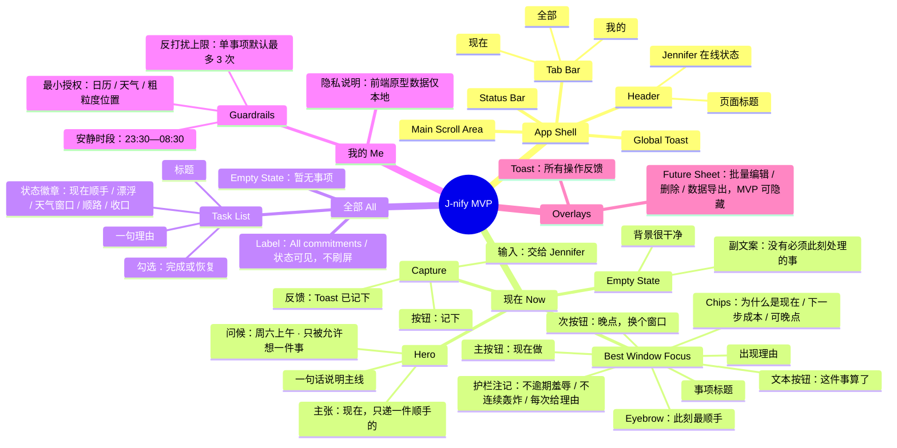
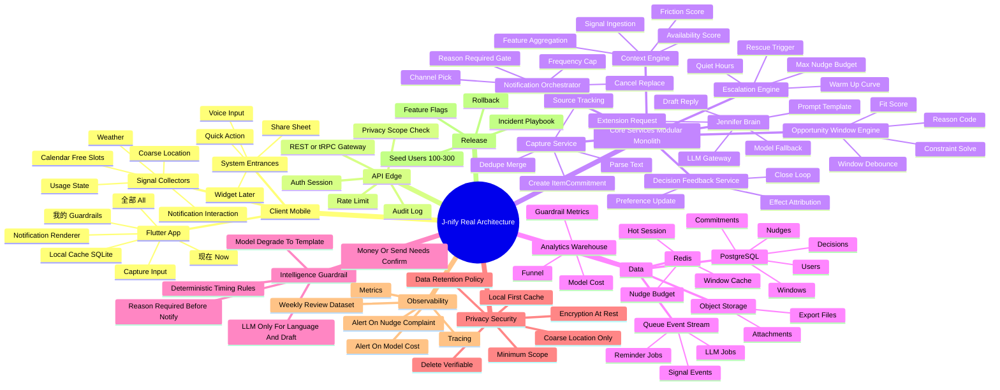

J-nify 项目立项 Spec（完整版）

- 产品名：J-nify
- 品牌人格：Jennifer（女秘书）
- 文档性质：项目立项 Spec / PM-Design-Engineering 对齐文档
- 覆盖范围：原始立项书、产品结论、Design System、移动端 UI 布局与完整 Sitemap、真实数据模型 ER、架构设计思维导图、工程复现要点、验收标准
- 原型基线：单文件 HTML MVP Mockup，版本 ID `0f2778c`
- 当前原则：主线唯一，先证明“低打扰择机提醒”有效，再扩展智能与功能

---

0. 一句话结论

J-nify 不是待办清单，也不是闹钟；它是一位叫 Jennifer 的低打扰行动秘书。产品主线只有一条：

> 用户把一件“不急但会忘”的事交给 Jennifer → Jennifer 让它低电量漂浮 → 在天气、日历空档、位置、使用状态或死线距离组成“顺手窗口”时出现 → 用户用最低阻力选择：现在做 / 晚点做 / 算了 / 帮我兜底。

成功标准不是打开率，而是：死线前少完蛋、无死线事项不蒸发、用户不因被催促而关闭通知。

---

1. 产品定位与边界

1.1 目标用户

- 核心用户：P 人，即计划感弱、倾向拖延、但并非不想把事情做好的人。
- 扩展用户：J 人中也有大量“不紧急事项会蒸发”的场景；但首期不为重度项目管理用户设计。

1.2 核心痛点

P 人的死循环：

> 不紧急 → 放一边 → 彻底消失 → 死线 panic → 完蛋

Jennifer 不解决“自律”，她解决“时机”和“阻力”：

1. 让事情不消失：低存在感漂浮。
2. 让时机可解释：为什么是现在。
3. 让下一步足够小：30 秒—15 分钟。
4. 让退路体面：晚点、放弃、兜底都算闭环。

1.3 产品口号

> 不急，但我帮您盯着。

1.4 In Scope（首期）

- 一句话录入、分享录入、语音录入的工程接口预留。
- 五类高频事项：账单、退货、作业、社交回复、生活杂事。
- 状态机：captured → parked → window_candidate → nudged → done / deferred / abandoned / rescued。
- 机会窗口：到期日、天气、日历空档、粗粒度位置、使用状态。
- 三选项决策：现在做 / 晚点做 / 算了；扩展项：帮我兜底。
- 反打扰护栏：安静时段、单事项提醒上限、“别再提”一次生效。
- 记忆校准：记录有效窗口、被嫌弃话术、放弃后的真实后果。

1.5 Out of Scope（首期不做）

- 多人协作项目管理、甘特图、OKR、打卡排行。
- 强制专注、锁机、红色逾期羞辱。
- 泛聊天陪伴、情绪树洞。
- 未经用户确认的真实付款、真实对外发送、真实下单。
- 过度采集：精确轨迹、通讯录全文、聊天内容抓取。

---

2. MVP UX 主线

最佳 UX 逻辑采用“单任务焦点 + 渐进披露”：

1. 首屏只给一件此刻最顺手的事，避免列表压迫。
2. 录入永远可用，但录入后只确认，不逼计划。
3. 其余事项收进“全部”，用状态而非红字表达。
4. 决策永远保留体面出口：现在做 / 晚点 / 算了。
5. 所有提醒必须解释“为什么是现在”；没有理由就不出现。

用户路径：

```text
打开 App
→ 看到一句安心主张：现在，只递一件顺手的
→ 可说一句话交给 Jennifer
→ 看到 Best window 焦点卡：事项 + 理由 + 下一步
→ 三选一：现在做 / 晚点，换个窗口 / 这件事算了
→ Toast 收口；事项进入下一个状态
→ 需要全局视角时，点底部“全部”查看，不被迫管理
```

---

3. Design System

3.1 设计关键词

克制、呼吸感、低打扰、可靠、体面、秘书感。避免“效率工具焦虑红”、避免游戏化打卡、避免信息堆叠。

3.2 色彩 Tokens

Token	值	用途	
`--bg`	`#F7F7F4`	App 主背景，暖白纸感	
`--card`	`#FFFFFF`	卡片与输入容器	
`--ink`	`#17171A`	主文本与关键按钮	
`--sub`	`#76767D`	次级文本	
`--line`	`#E8E8E3`	分隔线、边框	
`--accent`	`#FF5A4E`	当前最佳窗口、主 CTA、Jennifer 状态点	
`--accent-soft`	`#FFF0EF`	热点徽章、轻提示背景	
`--green`	`#35C759`	完成态、窗口可用指示	
`--shadow`	`0 26px 80px rgba(0,0,0,.18)`	设备外阴影	
焦点卡阴影	`0 16px 46px rgba(23,23,28,.08)`	当前事项浮起感	

语义规则：红色只用于“此刻值得注意”，不用于逾期惩罚；绿色只表示可用窗口或完成；灰色承担大部分状态，避免制造焦虑。

3.3 字体与排版

- 字体栈：`-apple-system, BlinkMacSystemFont, "PingFang SC", "Microsoft YaHei", sans-serif`
- 页面大标题：30px / 800–900 / letter-spacing -0.05em
- 主张标题：42px，移动端 ≤420px 收至 38px / line-height 1.02 / letter-spacing -0.065em
- 焦点事项标题：30px / 900 / line-height 1.08
- 正文：15px / line-height 1.7 / `var(--sub)`
- 说明与 meta：11–13px / `var(--sub)` 或 `#A7A7AD`
- 中文不使用斜体；强调用字重、颜色和 accent。

3.4 空间、圆角与触控

- 页面左右边距：18–22px。
- 主内容底部留白：≥104px，保证不被 Tab Bar 遮挡。
- 卡片圆角：焦点卡 30px；普通卡/列表项 18–20px；输入容器 20px。
- 触控目标：主按钮 ≥54px；Tab ≥56px；输入框按钮 ≥50px；列表勾选 24px 视觉、44px 热区由整行承担。
- 动效：仅入场淡入与 Toast 滑入；`prefers-reduced-motion` 下全部关闭。

3.5 组件规范

组件	规范	状态	
Status Bar	原型内模拟 9:41 / 网络 / 电量；真机由系统接管	固定	
Header	左大标题，右 Jennifer 状态点	标题随 Tab 切换	
Capture	输入 + 黑底“记下”按钮；录入后 Toast，不立即要求计划	空态 / 输入 / 已记下	
Focus Card	当前唯一最佳窗口；含 eyebrow、标题、理由、chips、三动作	有窗口 / 空态	
Primary Button	accent 实底；只承载“现在做”	默认 / 按下	
Secondary Button	浅灰底；承载“晚点”	默认	
Text Button	无框低强调；承载“算了”	默认	
Task Row	勾选圆点 + 标题 + 一句理由 + 状态徽章	parked/window/nudged/done	
Badge	灰底为中性；hot 用 accent-soft	状态展示，不操作	
Switch	我的页护栏开关	on/off	
Toast	顶部居中 pill，2.2s 自动消失	操作反馈	
Tab Bar	3 Tab：现在 / 全部 / 我的；active 使用 accent	固定底部	

3.6 文案 Tone

Jennifer 的话术规则：

- 不命令：不说“你必须现在做”。
- 不羞辱：不说“你又拖了”。
- 给理由：每条提醒必须能回答“为什么是现在”。
- 给退路：永远允许晚点或算了。
- 给最小下一步：把动作切到 30 秒—15 分钟。

示例：

- 好：“你刚刷手机 23 分钟，社交阻力最低。草稿已备好，30 秒能收尾。”
- 不好：“你已经三天没回小明了。”

---

4. UI 布局设计与完整 Sitemap

4.1 设备与外壳

工程复现基线：

```text
body
└── .device                 # 桌面展示用设备框；真机 <=420px 时退化为全屏
    └── .app                # 真实 App 容器，flex column
        ├── .status         # 状态栏模拟层
        ├── .header         # 顶部标题栏：页面标题 + Jennifer 状态
        ├── .toast          # 全局反馈，绝对定位
        ├── main.main       # 可滚动内容区，padding-bottom >= 104px
        │   ├── section.view[data-view="now"]
        │   ├── section.view[data-view="all"]
        │   └── section.view[data-view="me"]
        └── nav.tabbar      # 底部 3 Tab，固定
```

CSS 关键约束：

- `.device`: `width:min(414px,100vw)`; `height:min(896px,100dvh)`; `border-radius:46px`; 桌面展示带黑色机身与阴影。
- `@media (max-width:420px)`: 设备框退化，`width:100vw; height:100dvh; border-radius:0`，真机不显示假外壳。
- `.main`: `overflow:auto`; `scrollbar-width:none`; 底部留白避开 Tab Bar。
- 所有可滚动区域不得出现横向滚动。

4.2 Sitemap



4.3 页面状态

页面/组件	状态	表现	
现在	有最佳窗口	Focus Card 展示一件事，三动作完整	
现在	无事项	Focus Card 替换为“背景很干净”空态	
录入	空输入	Toast：一句话就够	
录入	成功	新事项进入 parked，Toast：记下了	
现在做	成功	当前事项 done，切到下一件，Toast 正向反馈	
晚点	成功	当前事项移到队列尾，不删除，Toast 承诺不轰炸	
算了	成功	当前事项 done/dropped，Toast 体面收口	
全部	有数据	列表按状态展示；勾选切换完成/恢复	
全部	无数据	空态	
我的	开关	Switch on/off；只影响演示状态，不暗示已接入真实权限	

4.4 关键交互 Flow

```text
Flow A：录入
输入一句话 → 点“记下”或 Enter → 清空输入 → unshift 到 items → 状态 parked → Toast「记下了：不急，但我帮您盯着。」

Flow B：现在做
点击“现在做” → active()[0].done=true → 保存 → 重新渲染 → Toast「完成。这个窗口有效，Jennifer 记住了。」

Flow C：晚点
点击“晚点，换个窗口” → active()[0] 移到数组尾 → 不删除不标红 → Toast「好，晚点。它不会消失……」

Flow D：算了
点击“这件事算了” → active()[0].done=true 且状态记为 dropped 语义 → Toast「已体面放弃……」

Flow E：全部页勾选
点击 check → done 取反 → done 时标题划线、check 变绿；恢复时回到 parked → 保存并重渲染
```

4.5 演示数据与工程迁移

原型 LocalStorage Key：`jnify-appframe-v1`。仅用于演示，正式工程不得把 LocalStorage 当作持久化方案。

原型字段到真实模型的映射：

原型字段	真实模型字段	说明	
`id`	`ItemCommitment.id`	UUID	
`title`	`ItemCommitment.title`	从 raw_text 解析	
`reason`	`OpportunityWindow.reason_text`	当前窗口理由	
`chips`	`OpportunityWindow.reason_code` + `ItemStep.est_minutes`	UI 聚合展示	
`fit`	`OpportunityWindow.fit_score`	0–100	
`badge`	状态派生	不入库，由 state/window 计算	
`done`	`ItemCommitment.status in done/abandoned/rescued`	原型简化	

---

5. 真实架构设计（思维导图）



---

6. 真实数据模型（ER）

```mermaid
erDiagram
    USER ||--o{ USER_PREFERENCE : has
    USER ||--o{ INTEGRATION_SOURCE : authorizes
    USER ||--o{ ITEM_COMMITMENT : delegates
    USER ||--o{ MEMORY_NOTE : accumulates
    USER ||--o{ FEEDBACK : gives

    INTEGRATION_SOURCE ||--o{ SIGNAL_EVENT : emits
    SIGNAL_EVENT ||--o{ CONTEXT_SNAPSHOT : aggregates_into

    ITEM_COMMITMENT ||--o{ ITEM_STEP : splits_into
    ITEM_COMMITMENT ||--o{ ESCALATION_POLICY : governed_by
    ITEM_COMMITMENT ||--o{ OPPORTUNITY_WINDOW : waits_for
    ITEM_COMMITMENT ||--o{ NUDGE : triggers

    CONTEXT_SNAPSHOT ||--o{ OPPORTUNITY_WINDOW : supports
    OPPORTUNITY_WINDOW ||--o{ NUDGE : schedules
    MESSAGE_TEMPLATE ||--o{ NUDGE : renders
    NUDGE ||--o{ NUDGE_OPTION : offers
    NUDGE ||--o| DECISION : closes_with
    NUDGE_OPTION ||--o| DECISION : selected_by
    DECISION ||--o{ FEEDBACK : produces
    DECISION ||--o{ MEMORY_NOTE : updates
    ITEM_COMMITMENT ||--o{ MEMORY_NOTE : relates

    USER {
      uuid id PK
      string nickname
      string timezone
      string jennifer_tone
      json privacy_scope
      string status
      datetime created_at
      datetime updated_at
    }

    USER_PREFERENCE {
      uuid id PK
      uuid user_id FK
      string scene
      string key
      string value
      float confidence
      datetime updated_at
    }

    INTEGRATION_SOURCE {
      uuid id PK
      uuid user_id FK
      string provider
      string auth_status
      json scopes
      datetime connected_at
      datetime revoked_at
    }

    SIGNAL_EVENT {
      uuid id PK
      uuid user_id FK
      uuid source_id FK
      string signal_type
      json payload
      float confidence
      datetime occurred_at
      datetime ingested_at
    }

    CONTEXT_SNAPSHOT {
      uuid id PK
      uuid user_id FK
      string snapshot_key
      json context_features
      float availability_score
      float friction_score
      datetime computed_at
    }

    ITEM_COMMITMENT {
      uuid id PK
      uuid user_id FK
      string title
      string raw_text
      string source_type
      string category
      string status
      datetime due_at
      datetime window_start
      datetime window_end
      int importance
      int urgency
      int abandon_cost
      int est_minutes
      json constraints
      datetime created_at
      datetime updated_at
      datetime closed_at
    }

    ITEM_STEP {
      uuid id PK
      uuid item_id FK
      int step_order
      string title
      int est_minutes
      string status
      json action_payload
      datetime created_at
      datetime done_at
    }

    ESCALATION_POLICY {
      uuid id PK
      uuid item_id FK
      string policy_type
      int max_nudges
      int nudge_count
      json warm_up_curve
      json quiet_hours
      json rescue_actions
      datetime created_at
    }

    OPPORTUNITY_WINDOW {
      uuid id PK
      uuid item_id FK
      uuid context_id FK
      datetime window_start
      datetime window_end
      float fit_score
      string reason_code
      string reason_text
      string status
      datetime created_at
      datetime expired_at
    }

    MESSAGE_TEMPLATE {
      uuid id PK
      string scene
      string tone
      string intensity_band
      string template_text
      json variables
      int version
      string status
    }

    NUDGE {
      uuid id PK
      uuid item_id FK
      uuid window_id FK
      uuid template_id FK
      int intensity
      string channel
      string title
      string body
      string status
      datetime scheduled_at
      datetime sent_at
      datetime opened_at
      datetime created_at
    }

    NUDGE_OPTION {
      uuid id PK
      uuid nudge_id FK
      string option_code
      string label
      string action_type
      json action_payload
      int sort_order
    }

    DECISION {
      uuid id PK
      uuid user_id FK
      uuid item_id FK
      uuid nudge_id FK
      uuid option_id FK
      string decision
      string reason
      json effect_metrics
      datetime decided_at
    }

    FEEDBACK {
      uuid id PK
      uuid user_id FK
      uuid decision_id FK
      string feedback_type
      int rating
      string comment
      datetime created_at
    }

    MEMORY_NOTE {
      uuid id PK
      uuid user_id FK
      uuid item_id FK
      uuid decision_id FK
      string memory_type
      string content
      float salience
      datetime expires_at
      datetime created_at
    }
```



6.1 核心状态机

```text
captured
  → parked                 # 已记下，低电量漂浮
  → window_candidate       # 出现潜在窗口
  → nudged                 # 已轻推
  → done                   # 完成
  → deferred               # 明确晚点，回到 parked 并记录原因
  → abandoned              # 主动放弃，体面收口
  → rescued                # 进入兜底：延期申请/上门取件/替代表达，仍需确认
```

状态约束：

- `parked` 不主动打扰，只允许被动可见。
- `window_candidate` 必须通过 reason gate 才能进入 `nudged`。
- `deferred` 不是失败；它是用户行使决策权。
- `abandoned` 后默认不再提醒，除非用户主动恢复或同类事项高价值。
- `rescued` 中涉及真实动作时必须二次确认。

6.2 关键字段说明

字段	含义	设计原因	
`fit_score`	当前窗口顺手程度	让 UI 只呈现最值得的一件事	
`reason_code/reason_text`	为什么是现在	没有理由不通知；提升信任	
`abandon_cost`	放弃成本	决定是否允许体面放弃，还是升温兜底	
`est_minutes`	下一步耗时	P 人只接受足够小的下一步	
`nudge_count/max_nudges`	已提醒次数/上限	反打扰红线	
`effect_metrics`	决策后效果	用于校准 Jennifer，而非惩罚用户	

---

7. 模块分立与接口预期

7.1 服务边界

模块	输入	输出	不做	
Capture Service	raw_text/share/voice transcript	ItemCommitment + initial policy	不立刻生成计划压迫	
Context Engine	SignalEvent	ContextSnapshot	不直接发通知	
Opportunity Window Engine	Item + Context + Preference	OpportunityWindow	不生成文案	
Escalation Engine	Item状态 + Decision历史 + Policy	intensity / should_nudge	不突破安静时段和预算	
Jennifer Brain	window + item + memory	title/body/options/rescue draft	不决定何时打扰	
Notification Orchestrator	nudge job	sent/cancelled/replaced	无理由不发送	
Decision Feedback	decision + feedback	preference/memory update	不用于羞辱排名	

7.2 API 草案

方法	路径	说明	
POST	`/v1/items/capture`	一句话/分享/语音转写录入	
GET	`/v1/now`	返回当前唯一 best window 或空态	
POST	`/v1/items/{id}/decision`	now/later/drop/rescue	
GET	`/v1/items?status=`	全部事项列表	
POST	`/v1/signals`	端侧信号批量上报，受 scope 限制	
GET	`/v1/guardrails`	安静时段、授权、提醒预算	
PUT	`/v1/guardrails`	更新护栏	
DELETE	`/v1/me/data`	可验证删除	
POST	`/v1/llm/draft`	仅限生成草稿，不直接执行真实动作	

---

8. 非功能需求

- 隐私：最小授权；粗粒度位置；默认不上传聊天正文；删除可验证；导出可用。
- 安全：传输加密、静态加密、审计日志、敏感动作二次确认。
- 性能：`GET /v1/now` P95 < 300ms；窗口计算异步；通知到达延迟 P95 < 5s。
- 可靠：弱网可录入；本地先存；事件上报可重放；提醒可撤回替换。
- 成本：LLM 仅用于解析、拆解、话术、兜底；时机判断用确定性规则；模板可降级。
- 可观测：记录 nudge sent/opened/decision/complaint；模型成本与降级率；投诉率触发告警。

---

9. 指标与验收

9.1 北极星指标

进入机会窗口后 72 小时内，事项完成、明确延期、主动放弃或接受兜底的比例。

9.2 救命指标

- 死线前完成率上升。
- last-minute panic 自报下降。
- 无 deadline 事项 30 天内推进率。
- 兜底方案采纳率。

9.3 信任指标

- 通知关闭率不升。
- 提醒理由展开率。
- 用户主动说“帮我记着”的周次数。
- 复盘页偏好修改率。

9.4 打扰红线

- ~~单事项默认最多 3 次主动提醒。~~（**2026-08-29 Q1 定案修订**：删除硬编码次数上限；频率管理交由 Jennifer agent 通过节奏策略动态决定。）
- 用户连续两次忽略同类提醒后自动降频（交由 Jennifer agent 依据行为反馈动态执行）。
- “别再提”必须一次生效。
- 没有理由不通知（无真实信号依据时不得编造理由）。
- 涉及钱/对外发送必须二次确认。
- 硬护栏仅保留：安静时段（按用户时区）+ 窗口级 nudge 去重。

9.5 MVP 验收用例

> **2026-08-29 H3 定案**：验收用例拆两列——「手动窗口判定」（M0 现状可过）与「信号窗口判定」（M1 完成标准）。

| 用例 | 手动窗口判定（M0/M0.5 现状） | 信号窗口判定（M1 完成标准） |
| --- | --- | --- |
| 1. 信用卡账单 | 录入当天只确认；距死线 ≤10 天（或节奏表命中）在 App 内出现顺手窗口 | 到期前 10/3 天节奏提醒真实触达（本地通知），用户可改期，不每日追问 |
| 2. 晒被子 | 无死线，App 内手动窗口可见 | 连续晴天微风（OpenWeather + 模糊化定位）触发天气窗口；再等等后按冷却（默认 72h）不再追问 |
| 3. 回小明 | 无闹钟；App 内 social 事项以 manual_window 诚实理由出现 | 本地 UsageStats 检测到刷手机 ≥20 分钟触发使用状态窗口，并附回复草稿（Jennifer 生成） |
| 4. 小组作业 | 可录入作业与期限，App 内窗口可见 | 节奏表（10/5/3 天）渐进提醒；Day13 前提供“今晚三小时”或延期申请草稿 |
| 5. 七天退货 | 可录入退货与期限，App 内窗口可见 | 第 3/5/1 天节奏提醒 + 上门取件要素清单（Jennifer 生成，用户确认） |

M1 完成定义 = 四信号源（usage/系统日历/天气/位置）接入 + 本地执行闭环（通知触达）+ 节奏表生效 + 兜底草稿可生成。

---

10. 里程碑

里程碑	周期	交付	通过条件	
M0 骨架	2 周	录入—漂浮—手动窗口—三选项闭环	五用例可走查；无真实信号也能演示	
M1 信号	—	屏幕使用/系统日历/天气/位置（本地处理）+ 本地通知执行层 + 节奏表	提醒均有真实理由；执行层本地闭环生效（2026-08-29 v0.2.0 实施中）
M2 Jennifer 大脑	4 周	LLM 解析、拆解、话术、兜底草稿；降级与成本护栏	模型断网/超支可降级模板	
M3 灰度	2 周	100–300 种子用户；指标看板；事故预案	只看闭环率、打扰红线、主动托付次数	

---

附录 A：原始完整立项书

> 以下为上传原始文档全文保留，仅按 Spec 结构收录。

J-nify 项目立项文档

---

一、项目背景与原始需求

需求 1：项目定位

> 我想创建一个项目：名称叫J-nify，功能是帮助P人（MBTI类别中属于P人，即生活处事方面倾向于少计划，计划感差的人）的生活更有规划性，以及敦促p人在闲时能动起来。

需求 2：产品命名与品牌设定

> 你这个计划就很J。先不要长篇大论：首先需要你站在用户的视角下去看，站在体验者而非技术实现者的视角去看，有哪些典型用例？我们目前可以确定的是，我们的产品名叫J-nify，APP进入后我们的品牌吉祥物叫Jennifer（女秘书）

需求 3：核心痛点聚焦

> 注意一个更典型的情况：无论是j人还是p人，这个人生活中一定是有很多事情需要做的，p的悲剧在于，一些不需要现在解决的事情，总是拖到最后，要么没时间做，要么干脆完全忘掉有这回事了！但是如果说你让他一件事出现后立马就做，这又不现实，并且真的会让人很难受。所以需要你想一下：我们的APP，Jennifer应该怎么做？

---

二、产品核心设计：Jennifer 如何帮助 P 人

你点到了P人最核心的死循环：

> "不紧急 → 放一边 → 彻底消失 → 死线 panic → 完蛋"

Jennifer 要做的不是催，而是让事情在P人的潜意识里持续"低电量运行"，直到出现一个"顺手就能做"的窗口。

---

用例 1：收到信用卡账单，月底才到期

P人现状：现在才月初，月底还早，关掉通知，月底 panic。

Jennifer 的做法：

> 账单进来的当天，Jennifer 只说一句话：
"收到一笔账单，到期日 9/30。我帮您记下了，不会打扰您，月底前十天我会再提一次。"

然后她真的消失了。

9 月 20 日，Jennifer 弹出：

> "老板，那笔账单还有 10 天。您现在手头宽裕吗？如果顺手，花 2 分钟就能搞定；如果还在等工资，我 25 号再提醒您。"

关键：她没有说"你该还钱了"，而是把决策权和一个舒服的时机一起递过来。

---

用例 2：妈妈上周说"有空把冬天的被子晒一下"

P人现状：没有 deadline，属于"无限期拖延直到冬天来了发现被子还是潮的"。

Jennifer 的做法：

> "记下了：晒被子。这件事没有 deadline，但我看了天气预报，本周三、周四连续晴天，微风。您要不要考虑那两天？我提前一晚提醒您，您只需要回答'晒'或'再等等'。"

如果用户选"再等等"：
Jennifer 不会每周都问，而是等下一个"完美天气窗口"再出现。

她让一件没有 deadline 的事，有了"最佳行动时机"的锚点。

---

用例 3：朋友微信说"有空约饭"，P人想"过两天回"

P人现状：过两天 = 两周后突然想起来，对方已经觉得被冷落了。

Jennifer 的做法：

用户可以对 Jennifer 说："帮我记着回小明消息"。

Jennifer 不会设一个"今天下午 3 点回复"的闹钟，而是：

> "收到，这件事不急。我会在您觉得比较闲的时候再提——比如您下次刷手机超过 20 分钟，或者周末上午。到时候我提醒您，您顺手回一句就行。"

两天后，周六上午 10 点，用户正躺在床上刷手机，Jennifer 轻轻弹出：

> "老板，您现在心情放松，要不要花 30 秒回一下小明？我帮您拟好了：'最近忙疯了，下周二晚上有空吗？请你吃饭赔罪。'"

结果：P人在最舒服的状态下，顺手解决了一件"会忘的社交债"。

---

用例 4：一个两周后截止的小组作业

P人现状：两周很长 → 最后三天通宵。

Jennifer 的做法（渐进式渗透）：

时间	Jennifer 的话	压迫感	
Day 1	"作业已录入。两周后交，不急，我先帮您拆成 4 个小块，您随时想看随时问我。"	0	
Day 5	"这周进度 0%，但没关系。我帮您查了一下，周三下午您日历是空的，要不要只花 15 分钟，先把资料搜一下？只搜，不写。"	1/10	
Day 10	"还剩 4 天。您现在完成度 0%，但我帮您算过了：如果今天开始，每天 40 分钟就能搞定。要我帮您把'今天只做大纲'设成唯一目标吗？"	3/10	
Day 13	"明天截止。您现在有两个选择：A. 今晚 3 小时搞定（我已把资料整理好）；B. 我帮您写一封诚恳的延期申请。您选哪个？"	6/10	

关键：Jennifer 的提醒强度是逐渐升温的，而不是从一开始就每天轰炸。她给P人留足了"假装这件事不存在"的空间，但确保在真正来不及之前，把阻力降到最低的下一步推到你面前。

---

用例 5：买了一件需要退货的衣服，7 天无理由

P人现状："明天去寄" × 7 天，最后一天发现快递站关门了。

Jennifer 的做法：

> Day 1："退货已记下，7 天窗口。我帮您查了一下，您家楼下快递柜 24 小时可用，寄件只需要 3 分钟。您不用现在去，我会在第 3 天和第 5 天各提醒您一次，挑您方便的时候。"

> Day 3（用户正在出门）："您现在出门，楼下就是快递柜，顺路吗？衣服和取件码我已帮您列好。"

> Day 5（用户还在拖延）："老板，还剩 2 天。如果您实在不想动，我帮您叫个上门取件，您只需要把衣服放门口。或者……您确定要留着这件不太合身的衣服吗？"

Jennifer 在最后关头提供了一个"比退货更懒"的选项（放着也行），倒逼用户做出选择。

---

三、Jennifer 的核心机制总结

传统日程 App	Jennifer	
设一个时间点，到点响铃	不设时间点，设"状态窗口"	
到点了必须做，不做就红字逾期	到点了提供三个选项：现在做 / 晚点做 / 彻底放弃	
逾期后疯狂报警	逾期后帮你兜底（写延期申请 / 找替代方案）	
任务一旦录入就消失，直到 deadline	任务会持续以低存在感"漂浮"在背景里	

Jennifer 的口头禅应该是：

> "不急，但我帮您盯着。"

这句话对P人来说，比"请按时完成"有安全感一万倍。

---

文档生成时间：2026-08-25
